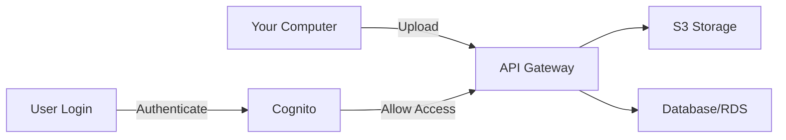

I'll create a beginner-friendly guide to help you set up your development environment and understand AWS services step by step.

# Part 1: Setting Up Your Local Development Environment

1. **Install Basic Tools**
   - Download and install Visual Studio Code (VSCode) from https://code.visualstudio.com/
   - This is your code editor - think of it like Microsoft Word, but for writing code
   - Install useful VSCode extensions:
     * Python
     * Flutter
     * React
     * AWS Toolkit

2. **Install Development Software**:
   ```bash
   # For Mac (using Homebrew):
   # First install Homebrew (package manager for Mac)
   /bin/bash -c "$(curl -fsSL https://raw.githubusercontent.com/Homebrew/install/HEAD/install.sh)"
   
   # Then install required software
   brew install python
   brew install node
   brew install flutter
   brew install aws-cli

   # For Windows:
   # Download and install:
   # 1. Python from python.org
   # 2. Node.js from nodejs.org
   # 3. Flutter from flutter.dev
   # 4. AWS CLI from aws.amazon.com
   ```

# Part 2: Understanding AWS Services

Let me explain each AWS service we're using in simple terms:

1. **AWS Cognito**
   - What it is: Think of it as a security guard for your app
   - Function: Handles user sign-up, sign-in, and account management
   - Why we need it: So users can securely log into your app
   - Learn more: Start with AWS's free "Introduction to AWS Cognito" course on AWS Skill Builder

2. **AWS S3 (Simple Storage Service)**
   - What it is: Like a massive hard drive in the cloud
   - Function: Stores your videos and other files
   - Why we need it: To save recorded videos securely
   - Learn more: AWS provides free "AWS S3 Basics" tutorials

3. **AWS RDS (Relational Database Service)**
   - What it is: Like Excel spreadsheets, but much more powerful
   - Function: Stores structured data (user info, video details)
   - Why we need it: To keep track of all app information
   - Learn more: Look for "AWS RDS for Beginners" on AWS Training

4. **AWS API Gateway**
   - What it is: Like a receptionist for your app
   - Function: Routes requests to the right service
   - Why we need it: To manage communication between app parts
   - Learn more: AWS offers "API Gateway Essentials" course

# Part 3: Setting Up AWS

1. **Create AWS Account**
   - Go to aws.amazon.com
   - Click "Create an AWS Account"
   - You'll need a credit card, but many services have a free tier
   - Set up Multi-Factor Authentication (MFA) for security

2. **Install AWS CLI**
   ```bash
   # Configure AWS CLI with your credentials
   aws configure
   # You'll need to enter:
   # - AWS Access Key ID
   # - AWS Secret Access Key
   # - Default region (e.g., us-east-1)
   ```

3. **Set Up Basic Services**

Let's create a simple diagram to show how these services connect:




# Part 4: Learning Path

1. **Start with AWS Basics**
   - Create a free AWS account
   - Take AWS Cloud Practitioner Essentials course (free)
   - Practice with AWS free tier services

2. **Learn Development Basics**
   - Start with Python (www.pythonforbeginners.com)
   - Learn basic React (reactjs.org/tutorial)
   - Try Flutter tutorials (flutter.dev/learn)

3. **Recommended Learning Order**:
   1. Basic Python programming
   2. AWS fundamentals
   3. Database concepts
   4. React basics
   5. Flutter basics
   6. API concepts

# Part 5: First Steps to Build

1. **Start Small**
   ```python
   # Simple Python recording script
   import sounddevice as sd
   import numpy as np
   import wave
   
   def record_audio(duration=5, fs=44100):
       recording = sd.rec(int(duration * fs), 
                        samplerate=fs, 
                        channels=2)
       sd.wait()
       return recording
   ```

2. **Test AWS Connection**
   ```python
   import boto3
   
   # Test S3 connection
   s3 = boto3.client('s3')
   buckets = s3.list_buckets()
   print("Your S3 buckets:", buckets)
   ```

Would you like me to:
1. Expand on any particular AWS service?
2. Create a detailed guide for setting up any specific component?
3. Provide more beginner-friendly coding examples?
4. Share resources for learning specific technologies?

Remember: Don't try to build everything at once. Start small, learn the basics, and gradually add more features. What aspect would you like to explore first?
