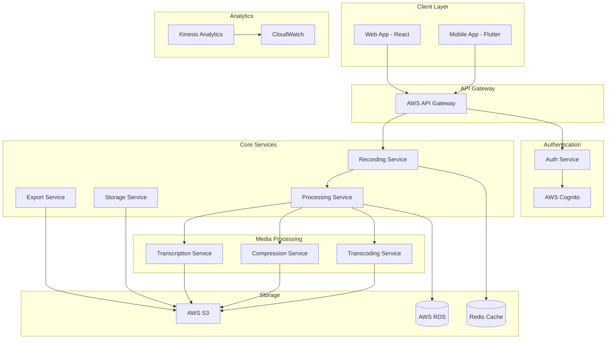
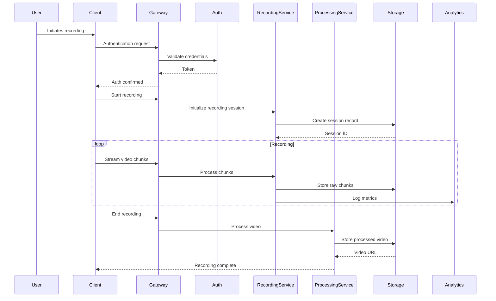

I'll help design and build this screen recorder application. Let's break this down systematically, starting with the feature list and architecture before diving into specific implementations.

Let's begin with the Feature List and Technical Architecture, then we can proceed with the other deliverables based on your feedback.

# Feature List

Based on analysis of leading screen recorders like Loom, Screencastify, and OBS:

Core Features:
- One-click screen recording with audio
- Multiple recording modes (full screen, window, custom area)
- System audio and microphone recording options
- Video quality settings (resolution, fps)
- Pause/resume functionality
- Instant cloud backup and synchronization
- Secure user authentication (OAuth 2.0, MFA)

Advanced Features:
- Basic video editing (trim, cut, merge)
- Custom watermarks and branding
- Automated transcription and closed captions
- Sharing capabilities with granular permissions
- Analytics dashboard for usage metrics
- Offline recording with background sync
- Annotation tools during recording
- Automated compression and optimization

Let me create a comprehensive technical architecture diagram to show how these features will be implemented.




Let me create a detailed data flow diagram to show how data moves through the system.



Now, let me outline the database schema for our application.


```sql
-- Users table
CREATE TABLE users (
    id UUID PRIMARY KEY,
    email VARCHAR(255) UNIQUE NOT NULL,
    name VARCHAR(255),
    created_at TIMESTAMP WITH TIME ZONE DEFAULT CURRENT_TIMESTAMP,
    last_login TIMESTAMP WITH TIME ZONE,
    settings JSONB,
    subscription_tier VARCHAR(50)
);

-- Recordings table
CREATE TABLE recordings (
    id UUID PRIMARY KEY,
    user_id UUID REFERENCES users(id),
    title VARCHAR(255),
    description TEXT,
    duration INTEGER,
    file_size BIGINT,
    resolution VARCHAR(20),
    status VARCHAR(50),
    created_at TIMESTAMP WITH TIME ZONE DEFAULT CURRENT_TIMESTAMP,
    updated_at TIMESTAMP WITH TIME ZONE DEFAULT CURRENT_TIMESTAMP,
    metadata JSONB,
    storage_path VARCHAR(512),
    privacy_setting VARCHAR(50)
);

-- Shares table
CREATE TABLE shares (
    id UUID PRIMARY KEY,
    recording_id UUID REFERENCES recordings(id),
    shared_by UUID REFERENCES users(id),
    shared_with VARCHAR(255),
    permission_level VARCHAR(50),
    created_at TIMESTAMP WITH TIME ZONE DEFAULT CURRENT_TIMESTAMP,
    expires_at TIMESTAMP WITH TIME ZONE
);

-- Analytics table
CREATE TABLE analytics (
    id UUID PRIMARY KEY,
    recording_id UUID REFERENCES recordings(id),
    viewer_id UUID REFERENCES users(id),
    view_date TIMESTAMP WITH TIME ZONE,
    watch_duration INTEGER,
    device_info JSONB,
    location JSONB
);

-- Create indexes for performance
CREATE INDEX idx_recordings_user_id ON recordings(user_id);
CREATE INDEX idx_shares_recording_id ON shares(recording_id);
CREATE INDEX idx_analytics_recording_id ON analytics(recording_id);
CREATE INDEX idx_recordings_created_at ON recordings(created_at);

```

Would you like me to proceed with implementing any specific component of the system, or would you prefer to review and provide feedback on the current design first? I can focus on:

1. Backend service implementation
2. Frontend React components
3. Flutter mobile app implementation
4. API specifications
5. Compliance documentation
6. Deployment configuration

Which aspect would you like to explore in more detail?
